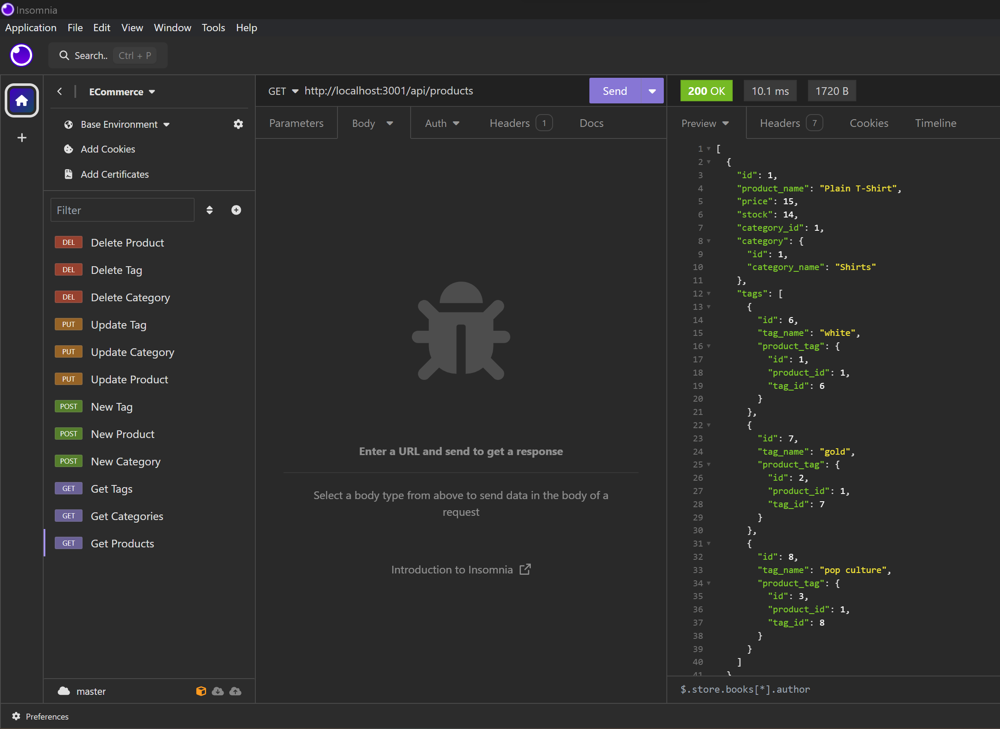

# ORM-ECommerce
As an internet retail company, I want a back end for my e-commerce website that uses the latest technologies, so that my company can compete with other e-commerce companies

## Description
* I am able to connect to a database using Sequelize
* WHEN I enter schema and seed commands
* THEN a development database is created and is seeded with test data
* WHEN I enter the command to invoke the application
* THEN my server is started and the Sequelize models are synced to the MySQL database
* WHEN I open API GET routes in Insomnia for categories, products, or tags
* THEN the data for each of these routes is displayed in a formatted JSON
* WHEN I test API POST, PUT, and DELETE routes in Insomnia
* THEN I am able to successfully create, update, and delete data in my database

## Installation
 * Express 4.17.1
 * Mysql2 2.1.0
 * Sequelize 5.21.7

## Usage
You will need to log into MySQL with your username and password. Then proceed to source the schema file and seed your data table. Run the server.js file to open the port to use in your Insomnia or Thunder Client application.

## Video Link
https://drive.google.com/file/d/16nJbwWwF_eUPNwxtvyxTnPHAcrzt2ZuH/view

## Screen Shot

## License
MIT

## Repository Link
https://github.com/JennaJay/ORM-ECommerce
